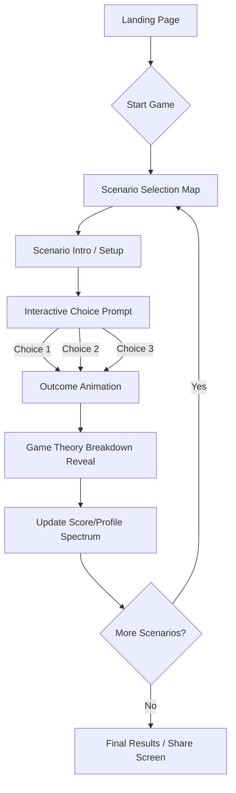

# Everyday Game Theory: Interactive Web App Specification

## 1. Overview and Goals
**Project Name:** Everyday Game Theory
**Goal:** To create a gamified, interactive web application that helps everyday people understand and learn Game Theory concepts visually, without overwhelming them with math or complex terminology. 
**Concept:** The app will guide users through 13 relatable, everyday scenarios (e.g., splitting a restaurant bill, messy kitchen standoffs, dating dilemmas). Users will make interactive choices in these scenarios, and the app will break down the game theory behind their decisions.

## 2. Target Audience
- General internet users looking for educational entertainment ("edutainment").
- Students studying economics, psychology, or sociology.
- Anyone who loves personality quizzes, interactive stories, and learning how human behavior works.

## 3. Core Features
- **Scenario-Based Learning:** 13 bite-sized interactive scenarios based on classic game theory models (Prisoner's Dilemma, Tragedy of the Commons, Nash Equilibrium, etc.).
- **Branching Interactive Choices:** Users are presented with a setup and multiple choices. The choice they make dictates the immediate outcome and the lesson learned.
- **"Game Theory Breakdown" Reveals:** After making a choice, the "curtain is pulled back," revealing the game theory concept behind the scenario using clear, jargon-free explanations.
- **Visual & Gamified Progress:** A visual map of scenarios to unlock, scoring (or personality tracking), and achievements.
- **"Rational Robot" vs. "Human Being" Spectrum:** Instead of standard points, users are scored on a spectrum. Choices that are purely logical push the meter towards "Rational Robot," while socially cooperative or fair choices push it towards "Human Being" (highlighting behavioral economics).

## 4. Proposed Tech Stack
- **Frontend Framework:** Next.js / React (for fast, component-based UI)
- **Styling:** CSS Modules / Vanilla CSS with rich, dynamic styling (vibrant colors, glassmorphism, modern typography like 'Inter' or 'Outfit').
- **Animations:** Framer Motion or CSS keyframes for micro-animations, smooth transitions between scenario steps, and satisfying button clicks.
- **State Management:** React Context or Zustand for tracking user progress, completed scenarios, and their "Rational vs. Human" score.

## 5. User Flow
The step-by-step journey of a user through the application.



## 6. Detailed Screen Breakdown & Wireframes

### Screen 1: Landing Page
**Purpose:** Hook the user, explain the concept simply, and start the experience.
**Elements:**
- Big, bold typography: "You're playing a game right now. You just don't know it."
- Subtitle explaining Game Theory in 1 sentence.
- A glowing, pulsing "Play Now" button.
- Floating, abstract 3D elements (a slice of cake, a coffee cup, a price tag) hinting at the scenarios.

**Wireframe (Conceptual):**
```text
+-----------------------------------------------------------+
|  [Logo] Everyday Game Theory                              |
|                                                           |
|                                                           |
|         YOU'RE PLAYING A GAME RIGHT NOW.                  |
|           YOU JUST DON'T KNOW IT.                         |
|                                                           |
|    (Game theory isn't math. It's just figuring out        |
|     what to do based on what others will do.)             |
|                                                           |
|                 +-----------------+                       |
|                 |   START GAME    |                       |
|                 +-----------------+                       |
|                                                           |
|       [Floating Cake]           [Floating Coffee]         |
+-----------------------------------------------------------+
```

### Screen 2: Scenario Selection / The Map
**Purpose:** Show progress and let the user pick their next scenario.
**Elements:**
- A visual path or grid.
- Locked/Unlocked states for the 13 scenarios.
- A progress bar and the "Rational vs. Human" meter.

**Wireframe (Conceptual):**
```text
+-----------------------------------------------------------+
|  < Back                                Score: Human 70%   |
|-----------------------------------------------------------|
|                                                           |
|                 CHOOSE YOUR DILEMMA                       |
|                                                           |
|    +---------+       +---------+       +---------+        |
|    | Scen. 1 | ----> | Scen. 2 | ----> | Scen. 3 |        |
|    | (Done)  |       | (Next)  |       | (Locked)|        |
|    +---------+       +---------+       +---------+        |
|                                                           |
|         +---------+       +---------+                     |
|         | Scen. 5 | <---- | Scen. 4 |                     |
|         | (Locked)|       | (Locked)|                     |
|         +---------+       +---------+                     |
+-----------------------------------------------------------+
```

### Screen 3: Scenario Interactive Screen (e.g., The Messy Kitchen)
**Purpose:** Deliver the setup and prompt the user for a choice.
**Elements:**
- Scenario Title ("The Messy Kitchen Standoff").
- Short, punchy setup text.
- Large, clickable choice cards. 
- Timer bar (optional, to add pressure).

**Wireframe (Conceptual):**
```text
+-----------------------------------------------------------+
|                                        Scenario 3 of 13   |
|-----------------------------------------------------------|
|                                                           |
|            THE MESSY KITCHEN STANDOFF                     |
|                                                           |
|  "The sink is full. Neither of you wants to wash them.    |
|   The longer they sit, the grosser it gets..."            |
|                                                           |
|  WHAT DO YOU DO?                                          |
|                                                           |
|  +---------------------------+ +------------------------+ |
|  |       HOLD OUT            | |       GIVE IN          | |
|  | Refuse to wash them,      | | Just wash them because | |
|  | hoping they break first.  | | you hate the smell.    | |
|  +---------------------------+ +------------------------+ |
|                                                           |
+-----------------------------------------------------------+
```

### Screen 4: Breakdown / Reveal Screen
**Purpose:** Explain the outcome and the Game Theory concept behind it.
**Elements:**
- Bold text declaring the outcome based on their choice.
- The "Game Theory Breakdown" box (explaining the concept, e.g., "The Game of Chicken").
- Impact on their score spectrum.
- "Next Scenario" button.

**Wireframe (Conceptual):**
```text
+-----------------------------------------------------------+
|                                                           |
|                 OUTCOME: COLLISION!                       |
|   "You both held out. The kitchen is now unlivable."      |
|                                                           |
|-----------------------------------------------------------|
|   THE GAME THEORY BREAKDOWN:                              |
|   Concept: The Game of Chicken                            |
|                                                           |
|   If you both hold out, it's a disaster. If one gives in, |
|   they lose time, but disaster is avoided. Your move      |
|   depends entirely on how stubborn the other person is!   |
|-----------------------------------------------------------|
|                                                           |
|   [+10 points to Rational Stubbornness]                   |
|                                                           |
|                 +-----------------+                       |
|                 | NEXT SCENARIO > |                       |
|                 +-----------------+                       |
+-----------------------------------------------------------+
```

## 7. Data Structure (Example Scenario JSON)
To power the app, scenarios will be stored in a structured format:

```json
{
  "id": "kitchen_standoff",
  "title": "The Messy Kitchen Standoff",
  "concept": "The 'Chicken' Game",
  "setup": "You and your roommate share a kitchen. The sink is full of dishes. Neither of you wants to wash them. The longer they sit, the grosser it gets.",
  "choices": [
    {
      "id": "c1",
      "text": "Hold out",
      "subtext": "Refuse to wash them, hoping your roommate breaks first.",
      "outcomeText": "You both hold out. The kitchen is a disaster.",
      "spectrumShift": "rational"
    },
    {
      "id": "c2",
      "text": "Give in",
      "subtext": "Just wash the dishes because you can't stand the smell.",
      "outcomeText": "You lose 20 minutes to chores, but the smell is gone.",
      "spectrumShift": "human"
    }
  ],
  "breakdown": "This is the Game of Chicken (like two cars speeding toward each other). If you both 'Hold out,' the kitchen becomes an unlivable disaster (the collision). If one person 'gives in,' they lose time doing chores, but the disaster is avoided. Your decision entirely depends on how stubborn you think your roommate is!"
}
```

## 8. Design & Aesthetic Guidelines
- **Color Palette:** Use vibrant, contrasting colors for choices (e.g., Coral Red vs. Teal Blue) to emphasize conflict and decision making.
- **Typography:** Modern, rounded sans-serif (e.g., 'Nunito' or 'Quicksand') to keep the tone friendly and non-academic.
- **Animations:** 
  - Cards should slightly tilt on hover (3D effect).
  - Score spectrum should physically animate (tug-of-war style) when points are added.
- **Accessibility:** Ensure high contrast for text, keyboard navigability for choices, and screen-reader friendly breakdowns.

## 9. Future Roadmap / V2 Features
- **Multiplayer Mode:** Invite a friend via link and play the scenarios *against* each other in real-time to see if you cooperate or betray.
- **Custom Avatars:** Build a visual avatar that changes based on your "Rational vs. Human" spectrum score.
- **More Scenarios:** Expand into dating, workplace negotiations, and online shopping game theory.
